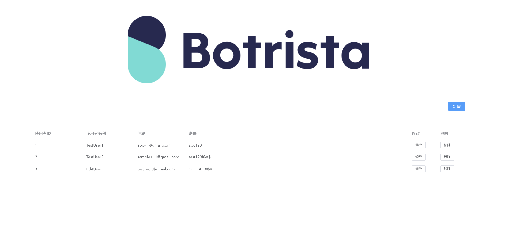

# Botrista interview questions

## Setup the environment with docker-compose
1. Install Docker and Docker-compose
2. Into QA_Interview_website folder
3. Run frontend and backend website with docker-compose
```
$ docker-compose up
```
4. Verify frontend and backend display well
- frontend domain: http://localhost:8080
- backend domain: http://localhost:8090


## Create test cases for this website

For example:
- Add new user via UI
- Add new user via API
...

## Write automation script for your test cases

1. Please use what you do best automation test framework (e.g. robotframework, pytest, cypress)
2. Create a public repository on your Github
3. Send your test cases and your repository to HR email